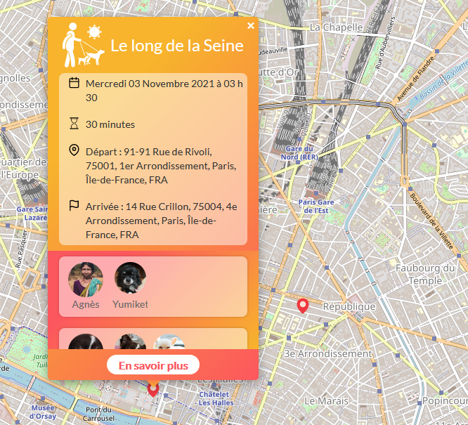

#  Cani' Potes  

## Contexte du projet

Après 3 mois de socle et 1 mois de spé(REACT ou DATA) au sein de l'école O'clock, Nous devions consacrer 4 semaines sur un projet de fin d'étude.Ce projet avait pour but de créer le Minimum Viable Product dans un temps imparti.

## Notre projet 

Le but de cette application web est d'offrir la possibilité aux maîtres de chiens d’organiser des balades collectives, dans l’objectif d'offrir un cadre social sain pour les animaux et les maîtres de chiens. Cela permettra de socialiser et sociabiliser les chiens, ce qui est très important afin qu’ils ne développent pas de troubles comportementaux
<p align="center">
</p>

## Notre equipe

- **Product Owner** : [Mathilde Chenillot](https://github.com/mathilde-chenillot)
- **Scrum Master** : [Julien Collet](https://github.com/JulienCLLT)
- **Lead dev Front** : [Raphaël Charousset](https://github.com/RaphaelCharousset)
- **Lead dev Back** : [Alexandra Bercoff](https://github.com/Alekiel42)
- **Git Master** : [Anne Osolin](https://github.com/AnneOsolin)


#### Critères de projet

- Le projet doit correspondre à un **objectif concret**, pouvant émaner d'une personne qui n'est pas développeur
  et dont la finalité n'est pas forcément une prouesse technique.

- Le projet doit être à la fois ambitieux et raisonnable, et pouvoir tenir dans un planning de **4 semaines**.
  * Sprint 0 : Première semaine sert à définir les bases, l'organisation, la structure du MVP du projet et la production de nombreux documents nécessaires au Titre professionnel (**code interdit**).
  * Sprint 1/2 : ***Deux semaines*** pour coder le projet.
  * Sprint 3 Dernière semaine pour débug/test le projet pour sa présentation.

- Le projet doit mettre en oeuvre les **compétences** abordées dans la formation Full-stack JavaScript.

- Le projet doit répondre au référentiel du titre professionnel Développeur Web et Web mobile niveau 5 => [fiche récap Titre Pro DWWM](https://www.banque.di.afpa.fr/espaceemployeurscandidatsacteurs/EGPResultat.aspx?ct=01280m03&cd=&cr=&type=t)
  
### Techno du projet

#### Front
 
- [HTML](https://developer.mozilla.org/fr/docs/Web/HTML)
- [SASS](https://sass-lang.com/)
- [REACT](https://fr.reactjs.org/) 
- [REACT-ROUTER](https://reactrouter.com/web/guides/quick-start)
- [REDUX](https://redux.js.org/)
- [AXIOS](https://axios-http.com/docs/intro)
- [LEAFLET](https://leafletjs.com/)

#### Back
- [NODE.JS](https://nodejs.org/en/)
- [POSTGRESQL](https://www.postgresql.org/docs/13/app-psql.html)
- [EXPRESS.JS](https://expressjs.com/fr/)
- [SQITCH](https://sqitch.org/docs)
- [CORS](https://www.npmjs.com/package/cors)
- [BCRYPT](https://www.npmjs.com/package/bcrypt)
- [JWT](https://github.com/auth0/node-jsonwebtoken) 
- [JOI](https://joi.dev/)
- [MULTER](https://www.npmjs.com/package/multer)
- [SHARP](https://www.npmjs.com/package/sharp)
- [NODE-FETCH](https://www.npmjs.com/package/node-fetch) 
- [API de conversion adresse en coordonnées longitude latitude](https://geo.api.gouv.fr/adresse)

#### Déploiement
- AWS (API)
- Surge (FRONT)

## Comment l'utiliser ? 

1. Télécharger le repo sur votre machine

```bash
git clone <url du repo>
```
2. Prérequis en local

- Sqitch
- Node.Js
- POSTGRESQL

1. Installez les dépendances en Back

```bash
cd projet-20-balade-entre-chien/API/
npm install 
```

3. Créer une base de données PostgreSQL   
4. Adaptez votre fichier `.env` avec les paramètres de connexion à votre base de données.
5. Créer un fichier `sqitch.conf` à la racine en vous aidant du fichier `sqitch.example.conf`. Adaptez les paramètres de connexion à votre base de données. 
6. Déployez le projet sqitch : `sqitch deploy`
7. Vous pouvez utiliser le fichier de seeding `seedForProd.sql` pour tester l'API avec des datas impératives. Plus d'informations ci-dessous.  
8. Exécuter `npm start` pour lancer l'API. 

3. Installez les dépendances en FRONT

```bash
cd projet-20-balade-entre-chien/FRONT/
npm install 

-Modifier le fichier `dburl.js`avec l'url qui pointe vers l'API deployée (localhost:xxxx)
-Exécuter `npm run dev` pour lancer l'API.

